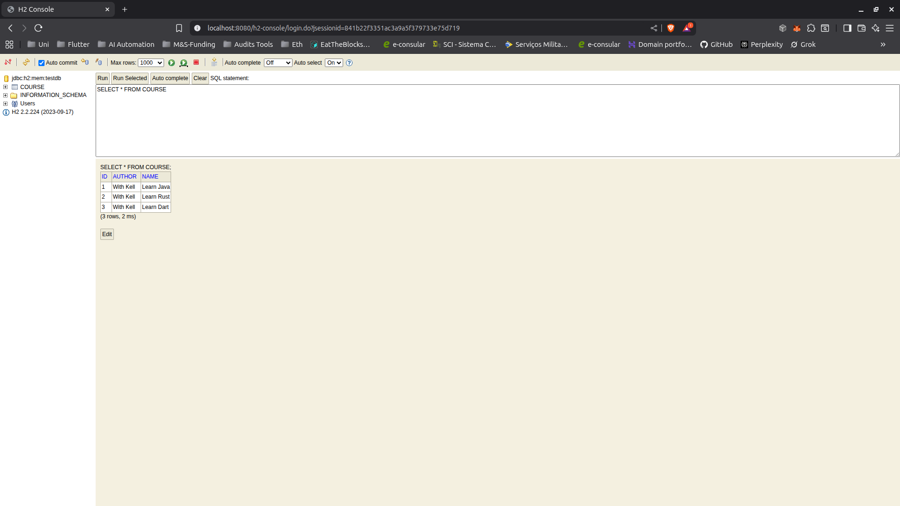

# JPA and Hibernate Demo Project



## Project Overview

This is a comprehensive Spring Boot demonstration project that showcases different approaches to database interaction in Java, progressing from traditional JDBC to modern Spring Data JPA implementations.

## Technologies Used

### Core Framework & Language
- **Java 21** - Latest LTS version
- **Spring Boot 3.3.5** - Main application framework
- **Maven** - Build automation and dependency management

### Database Technologies
- **H2 Database** - In-memory database for development and testing
  - H2 Console enabled for database inspection
  - JDBC URL: `jdbc:h2:mem:testdb`

### Data Access Technologies

This project demonstrates three different approaches to database operations:

#### 1. **Spring JDBC** (`CourseJdbcRepository`)
- Uses `JdbcTemplate` for database operations
- Manual SQL query writing
- `BeanPropertyRowMapper` for result set mapping
- Direct control over SQL statements

#### 2. **JPA (Java Persistence API) with Hibernate** (`CourseJpsRepository`)
- Uses `EntityManager` for database operations
- Jakarta Persistence annotations (`@Entity`, `@Id`, `@PersistenceContext`)
- Object-relational mapping
- No manual SQL required
- Transaction management

#### 3. **Spring Data JPA** (`CourseSpringDataJpaRepository`)
- Extends `JpaRepository` interface
- Zero boilerplate code
- Automatic CRUD operations
- Query derivation from method names
- Most modern and concise approach

### Web Layer
- **Spring Web** - REST API capabilities (starter included)

### Development Tools
- **Spring Boot Maven Plugin** - Application packaging and running
- **Spring Boot DevTools** - Development-time features

## Project Structure

```
com.kell.jpa_and_hibernate
├── course
│   ├── Course.java                    # Entity class with JPA annotations
│   ├── jdbc
│   │   ├── CourseJdbcRepository.java  # JDBC implementation
│   │   └── CourseJdbcCommandLineRunner.java
│   ├── jpa
│   │   ├── CourseJpsRepository.java   # JPA EntityManager implementation
│   │   └── CourseCommandLineRunner.java
│   └── springdatajpa
│       └── CourseSpringDataJpaRepository.java # Spring Data JPA interface
└── JpaAndHibernateApplication.java
```

## Key Features

### Course Entity
- Simple domain model with `id`, `name`, and `author` fields
- JPA annotations for ORM
- Standard getters, setters, and toString methods

### CRUD Operations
All three implementations provide:
- **Insert** - Add new courses to the database
- **Delete** - Remove courses by ID
- **Find by ID** - Query courses from the database

## Configuration

The application uses the following configuration (`application.properties`):
- H2 Console enabled for database inspection
- JPA SQL logging enabled for debugging
- In-memory database for quick testing

## Learning Objectives

This project demonstrates:
1. **Evolution of data access** - From JDBC to Spring Data JPA
2. **Comparison of approaches** - See the same operations implemented three different ways
3. **Spring Boot integration** - How different data access technologies integrate with Spring
4. **JPA/Hibernate fundamentals** - Entity mapping, persistence context, and ORM concepts

## SQL Examples (from notes.txt)

```sql
-- Insert
insert into course (id, name, author)
values(1, 'Learn AWS', 'Kellspell');

-- Select
select * from course

-- Delete
delete from course where id=1
```

## Developer Information

**Developed by Kell Silva**

- GitHub: [https://github.com/kellspell](https://github.com/kellspell)
- LinkedIn: [https://www.linkedin.com/in/kell-silva-4539b8168/](https://www.linkedin.com/in/kell-silva-4539b8168/)

## Getting Started

### Prerequisites
- Java 21 or higher
- Maven 3.x

### Running the Application

```bash
# Using Maven wrapper
./mvnw spring-boot:run

# Or using Maven
mvn spring-boot:run
```

### Accessing H2 Console
Navigate to: `http://localhost:8080/h2-console`
- JDBC URL: `jdbc:h2:mem:testdb`
- Default credentials (if not configured): username: `sa`, password: (empty)

## Reference Documentation

* [Official Apache Maven documentation](https://maven.apache.org/guides/index.html)
* [Spring Boot Maven Plugin Reference Guide](https://docs.spring.io/spring-boot/4.0.0-M3/maven-plugin)
* [Spring Web](https://docs.spring.io/spring-boot/4.0.0-M3/reference/web/servlet.html)
* [Spring Data JDBC](https://docs.spring.io/spring-boot/4.0.0-M3/reference/data/sql.html#data.sql.jdbc)
* [Spring Data JPA](https://docs.spring.io/spring-boot/4.0.0-M3/reference/data/sql.html#data.sql.jpa-and-spring-data)

## Additional Guides

* [Building a RESTful Web Service](https://spring.io/guides/gs/rest-service/)
* [Serving Web Content with Spring MVC](https://spring.io/guides/gs/serving-web-content/)
* [Building REST services with Spring](https://spring.io/guides/tutorials/rest/)
* [Using Spring Data JDBC](https://github.com/spring-projects/spring-data-examples/tree/master/jdbc/basics)
* [Accessing Data with JPA](https://spring.io/guides/gs/accessing-data-jpa/)
